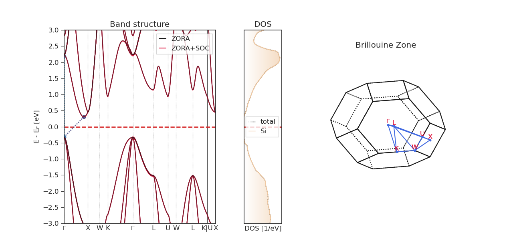

# Visualizing Results

The command-line utility `aims_plot` offers a quick-and-dirty approach to visualize band structures and densities of states. It is not meant to yield best-looking plots for every possible scenario. In that regard, please consider the examples on how to use the python interface for plotting.

The utility can be used in the following fashion:

```bash
aims_plot -bs /path/to/bandstructure -dos /path/to/dos -mbs /path/to/mullikenbands -v 
```

The option `-v` means that verbose logging will be enabled, which prints out additional information about the band gap.
With the option `-s`, you can specify key-value pairs, such as `reference="VBM"` to set the reference energy to the valence band maximum. However, these options may be rather limited and can lead to conflicts.



