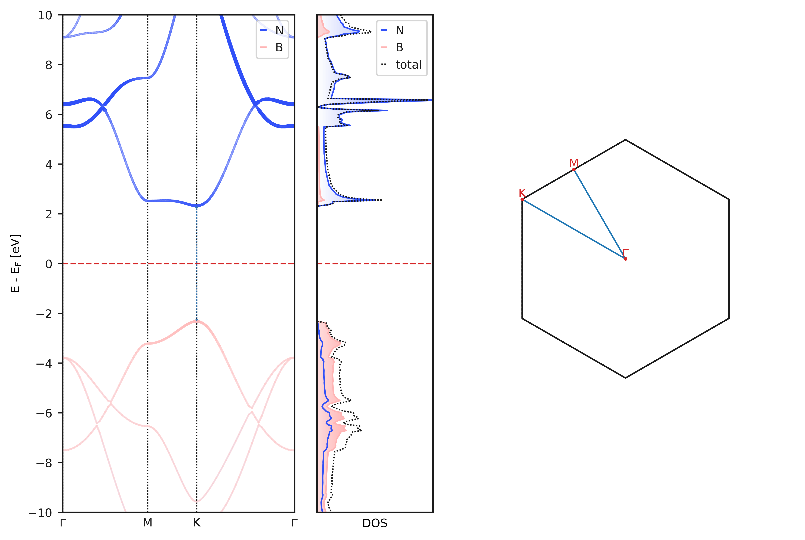

# Visualizing Results

The command-line utility `aims_plot` can be used to plot band structures, densities of states and phonons out-of-the-box with sensible defaults. For more advanced plots, it is easier to use the python interface.

The utility is a typer interface:

```bash
aims_plot -bs path/ -dos path/ -t paper bandpath='GMKG'
```

The option `-t` or `--target` can either be `presentation` or `paper` and chooses sensible defaults for font sizes, line widths etc. The latter option also saves the plot to a file named `aimsplot.png`.

Any keyword arguments can be specified as key-value pairs separated by an equal sign, such as `reference="VBM"` or `bandpath="GMKG"`.



