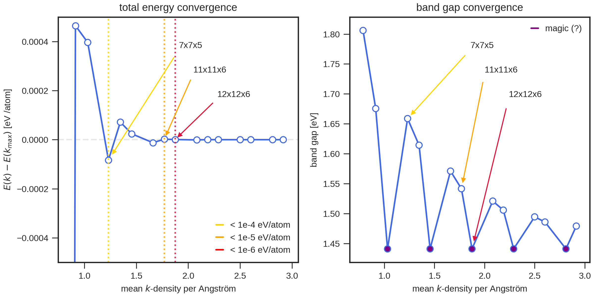

# Converging the k-grid

The **aims_kconvergence** tool automates the process of converging the k-grid. It has two different modes:

1. Setting up the calculations with increasing k-point density, respecting the size and shape of the unit cell.
2. If results are available (directories which contain then name "kconv"), the total energy convergence and band gap convergence are evaluated and plotted.

The input for this tool is a directory or a file containing a structure. If a calculation setup (*control.in*) is in this directory, this one will be used.

A typical workflow looks like this:

- Set up calculations using **aims_prepare**.
- Modify the *control.in* for specific purposes, e.g., enabling dispersion corrections.
- Run ```aims_kconvergence directory -t *.sh ```. This will create many subdirectories with the different k-grids. The option ```-t *.sh``` tells the tool to copy the submission file into these directories.
- Submit all calculations (```for j in kconv_*; do (cd $j && sbatch *.sh); done```).
- After all calculations finished, rerun ``` aims_kconvergence directory ```. This will evaluate the energies and band gaps. The most important lines of the logging information look like this:

```bash
INFO    │ The k-kgrid is converged within  1.0E-04 eV/atom for a grid of 7x7x5 after 20.0 SCF cycles.
INFO    │ The k-kgrid is converged within  1.0E-05 eV/atom for a grid of 11x11x6 after 20.0 SCF cycles.
INFO    │ The k-kgrid is converged within  1.0E-06 eV/atom for a grid of 12x12x6 after 20.0 SCF cycles.
INFO    │ The k-grids 6x6x4, 9x9x5, 12x12x6, 15x15x7, 18x18x9 could be magic.
INFO    │ Results have been saved to kconv.png.
```

This means, that a k-grid of 12x12x6 is sufficient to reach convergence below 1.0E-06 eV/atom, which is a fairly tight criterion. If the convergence is smooth, some tasks may not need such a tight convergence.

For this example of bulk MoS2, the results look like the following:



The convergence of the total energy and the convergence of the band gap may oscillate strongly depending on the k-grid. Because both the valence band maximum and the conduction band minimum are located at high-symmetry points in the Brillouine Zone (G and K, respectively), the value of the band gap is only exact if both these points are included in the grid. Since the structure of MoS2 is hexagonal, the point K is only captured for grids that are multiples of three in the x and y direction. These are kind of magic numbers for specific systems and should be employed if possible. The workflow tries to detect magic grids automatically if certain band gap values occur repeatedly, but the position of the band extrema can be different for each system. In the case of MoS2, using the 12x12x6 grid is advisable, because both band extrema are captured and the total energy is converged.